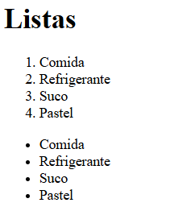
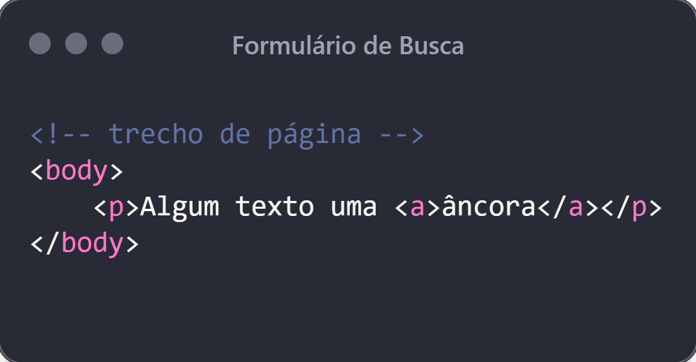
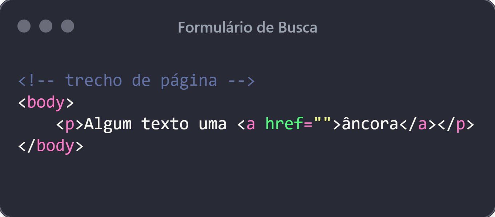
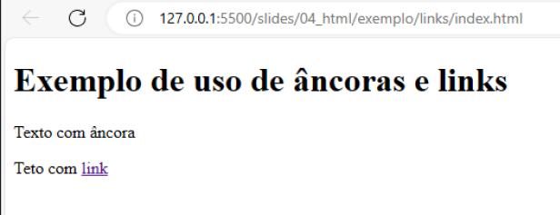
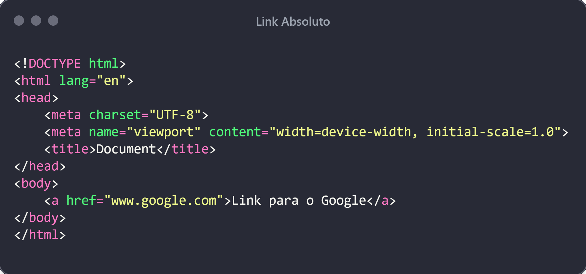
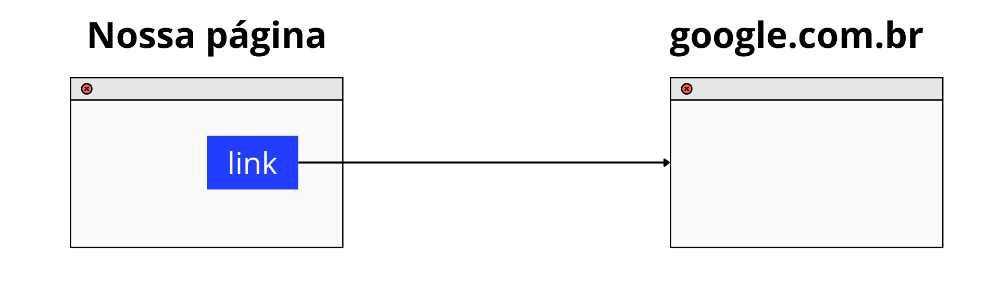
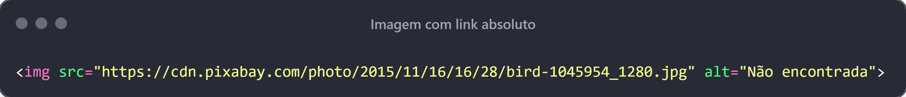
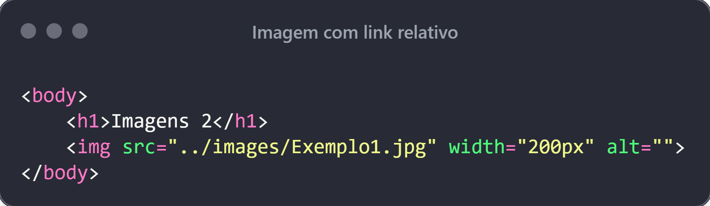
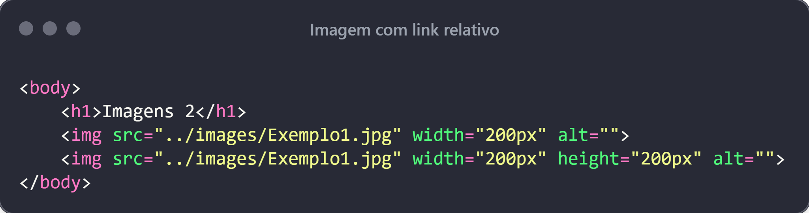
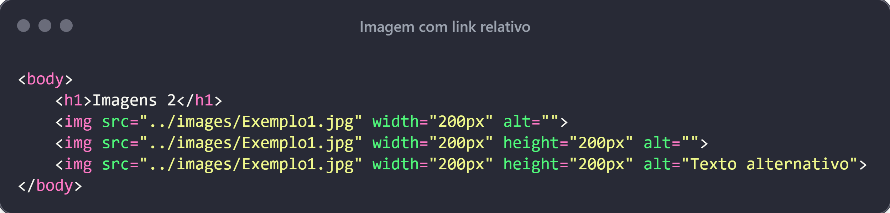

# HTML

---

## HTML

- Estrutura de uma página
- Elementos Cabeçalho
- Elemento parágrafo
- Listas
- Âncora
- Imagem

---

## HTML

- HyperText Markup Language: **Linguagem de Marcação de Hypertexto** [1](https://developer.mozilla.org/pt-BR/docs/Learn/Getting_started_with_the_web/HTML_basics).

- Não é uma linguagem de programação

- É utilizada para estruturação do conteúdo de uma página

- As páginas HTML são compostas de **elementos**. Este elementos podem conter texto, imagem ou algum outro item de dado

---

## HTML

- Exemplo de página HTML

```html
<!DOCTYPE html>
<html lang="en">
<head>
    <meta charset="UTF-8">
    <meta name="viewport" content="width=device-width, initial-scale=1.0">
    <title>Document</title>
</head>
<body>    
    <h1>Olá Mundo</h1>
</body>
</html>
```

---

## HTML

- `<!DOCTYPE html>`: É a parte inicial obrigatória do documento. **Não é uma tag HTML**. Apenas indica ao navegador o tipo de documento - HTML. [1](https://www.w3schools.com/tags/tag_doctype.ASP)
- `<html> </html>`: elemento que envolve todo o conteúdo da página
- `<head> </head>`: elemento onde se coloca tudo que não for o conteúdo propriamente dito: arquivos de estilo.
- `<body></body>`: Local onde se adiciona o conteúdo propriamente dito (links, botões, imagens, textos e etc)

---

## HTML

- O elemento `<head></head>` permite que adicionemos coisas como:
  - `<title>Minha página</title>`: este elemento indica o título da página
- O elemento `<meta charset="UTF-8">` permite adicionar metadados. Neste exemplo, estamos definido a codifição de caracteres da página. [1](https://developer.mozilla.org/pt-BR/docs/Web/HTML/Element/meta#charset), [2](https://www.w3schools.com/html/html_charset.asp)
- Em breve vamos adicionar estilo as páginas e o local para fazer isso é no `<head> </head>`

---

## HTML

- Estrutura regular de uma `tag`

<div class="wrapper">


Fonte: [https://developer.mozilla.org/pt-BR/docs/Glossary/Element](https://developer.mozilla.org/pt-BR/docs/Glossary/Element)

</div>

---

## HTML

- Obeserve que os elementos HTML em geral inciam e são finalizados com uma tag (Há casos onde não há essa regra)
- Eles possuem algum **conteúdo** e uma boa varidade de **[atributos](https://developer.mozilla.org/pt-BR/docs/Glossary/Attribute)**
- Estes atributos permitem modificações no comportamento do elemento ou fornecendo algum metadado.
- Há [atributos globais](https://developer.mozilla.org/pt-BR/docs/Web/HTML/Global_attributes) (todos os elementos possuem) e atributos específicos de cada elemento.

---

## HTML

- [Elemento Cabeçalho](https://developer.mozilla.org/pt-BR/docs/Learn/Getting_started_with_the_web/HTML_basics#cabe%C3%A7alhos): `<h1>, <h2>, <h3>, <h4>, <h5>, <h6>`
  - Os elementos de cabeçalhos permitem especificar que certas partes do seu conteúdo são títulos ou subtítulos

- [Elemento Parágrafo](https://developer.mozilla.org/pt-BR/docs/Learn/Getting_started_with_the_web/HTML_basics#par%C3%A1grafo): `<p>meu texto</p>`
  - estes elementos são utilizados para adicionar conteúdo textual de forma a serem entendidos como parágrafos de um texto.
- [Elemento Listas](https://developer.mozilla.org/pt-BR/docs/Learn/Getting_started_with_the_web/HTML_basics#listas): Elemento utilizado para criação de listas na web (veremos detalhes na prática).

---

## HTML - Listas

- Há dois elementos HTML representam listas: `ol` e `ul`
- O elemento `ol` representa uma lista ordenada. A ordenção é feita a partir de 1 e segue até o número N da lista.
- O elemento `ul` utiliza o símbolo &#x2022; (bullet point).

<div class="wrapper">



Fonte: própria.

</div>


---

## HTML - Listas

- O código para gerar as listas do exemplo anterior é o seguinte:

```htm
<ol>
    <li>Comida</li>
    <li>Refrigerante</li>
    <li>Suco</li>
    <li>Pastel</li>
</ol>

<ul>
    <li>Comida</li>
    <li>Refrigerante</li>
    <li>Suco</li>
    <li>Pastel</li>
</ul>
```

---

## HTMLS - Listas

- Observe que as tags `ol` e `ul` definem a listas.
- Para adicionar elementos na listagem basta utilizar o elemento `li`. Ele vai se adaptar ao tipo de lista que utilizarmos.
- É possível fazer alterações na versão padrão das listas. Por exemplo, há atributo para alterar o símbolo utilizado na lista `ul`. Assim como, modificar o tipo de numeração usada na lista `ol`. 

- Confira aqui os atributos: [ol](https://developer.mozilla.org/pt-BR/docs/Web/HTML/Reference/Elements/ol) e [ul](https://developer.mozilla.org/pt-BR/docs/Web/HTML/Reference/Elements/ul)

---

## HTML - ÂNCORA

- Há um elemento definido pela tag `<a>` que é definido como âncora(*anchor*).
- A aplicar a tag `<a>` com algum conteúdo, indicamos que estamos definido uma âncora.

<div class="wrapper">



Fonte: prórpia.

</div>

---

## HTML - ÂNCORA

- É possível mudar a semântica do elemento `<a>` através de um de seus atributos: **href**

- Ao adicionar este atributo, estamos criando um *link* que permite realizar navegação entre páginas

<div class="wrapper">



Fonte: prórpia.

</div>

---

## HTML - ÂNCORA

- Até aí tudo bem. Mas na prática qual a diferença?
- A diferença visual na página é a ilustrada abaixo:

<div class="wrapper">



Fonte: prórpia.

</div>

---

## HTML - ÂNCORA

- Tipo de Link: **Links absolutos**

<div class="wrapper">


Fonte: prórpia.

</div>

---

## HTML - ÂNCORA

- Exemplo de uso de **links absolutos** em uma página:


<div class="wrapper">



Fonte: prórpia.

</div>


---

## HTML - ÂNCORA

- Os **links absolutos** permitem navegar de nossas páginas para outras páginas, por exemplo.

<div class="wrapper">



Fonte: prórpia.

</div>

---

## HTML - ÂNCORA

- **Links relativos**
  - O contexto dos links relativos é permitir a nevegação dentro do próprio site. 
- Considere a figura inicial desta aula. 
  - Há páginas que possuem setas (ligações dentro do próprio site)
-  O caminho é relativo ao local onde o arquivo está dentro do site (na organização dos arquivos)

---

## Imagens

- As imagens são definidas fora do conteúdo da página HTML
- Podemos referenciar as imagens dentro das páginas com links relativos ou absolutos.
- A tag utilizada para adicionar imagens é ``
- Adcionamente, temos o atributo `src` que permite indicar onde localizar a imagem


---

## HTML - Imagens

- As imagens podem ser de tipos diferentes como: PNG, JPEG, SVG, GIF.

**Atividade:**
  - Pesquisar as diferenças entre esses tipos e vantagens/desvantagens de uso.

---

## HTML - Imagens

- Exemplo de Imagem com link absoluto

<div class="wrapper">



Fonte: própria.

</div>

- Neste fragmente de código, o `src` está definido para um link na web onde está localizada a imagem.

---

## HTML - Imagens

- Podemos definir as dimensões que queremos para as imagens:

<div class="wrapper">



Fonte: própria.

</div>

- Neste caso, a altura será definida proporcional a largura `width`


---

## HTML - Imagens

- Neste trecho de código, temos a definição da segunda imagem com `width` e `height` definidos. 

<div class="wrapper">



Fonte: própria.

</div>

- Veja o resultado no navegador com os códigos de exemplo.

---

## HTML - Imagens

- Neste trecho de código, temos a definição da segunda imagem com `width` e `height` definidos. 

<div class="wrapper">


Fonte: própria.

</div>

- Veja o resultado no navegador com os códigos de exemplo.

---

## HTML

- Quando não é possível renderizar a imagem na página por alguma razão, podemos adicionar um texto alternativo. 
  
- Isso é realizado por meio do atributo `alt="Texto Alternativo"` 

<div class="wrapper">



Fonte: própria.

</div>

---


## Referência

Atributo HTML. (n.d.). MDN Web Docs. Retrieved March 6, 2024, from https://developer.mozilla.org/pt-BR/docs/Glossary/Attribute

Atributos Globais. (n.d.). MDN Web Docs. Retrieved March 6, 2024, from https://developer.mozilla.org/pt-BR/docs/Web/HTML/Global_attributes

Elemento. (n.d.). MDN Web Docs. Retrieved March 6, 2024, from https://developer.mozilla.org/pt-BR/docs/Glossary/Element

HTML básico. (n.d.). MDN Web Docs. Retrieved March 6, 2024, from https://developer.mozilla.org/pt-BR/docs/Learn/Getting_started_with_the_web/HTML_basics

---

## Referêcnia

HTML charset. (n.d.). W3schools.com. Retrieved March 6, 2024, from https://www.w3schools.com/html/html_charset.asp

HTML doctype declaration. (n.d.). W3schools.com. Retrieved March 6, 2024, from https://www.w3schools.com/tags/tag_doctype.ASP

(N.d.). Mozilla.org. Retrieved March 6, 2024, from https://developer.mozilla.org/pt-BR/docs/Web/HTML/Element/meta#charset


