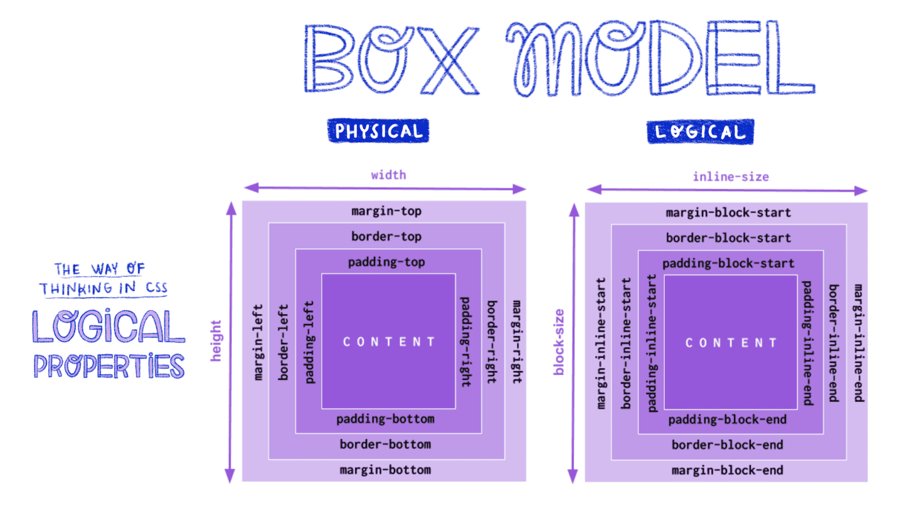

# Formatação Visual Básica no CSS

## 1. Caixas e o Modelo de Caixa

O CSS parte do princípio de que **todo elemento gera uma ou mais caixas retangulares**, chamadas *element boxes*.
Essas caixas formam a base da renderização visual de uma página.

Cada caixa possui (veja a figura a seguir):

* **Área de conteúdo (content area)**: onde o texto ou outro conteúdo aparece.
* **Padding (preenchimento)**: espaço entre o conteúdo e a borda.
* **Border (borda)**: linha que contorna a caixa.
* **Margin (margem)**: espaço externo entre a caixa e os elementos vizinhos.
* **Outline (contorno)**: linha desenhada fora da borda, não ocupa espaço.

### Exemplo:

```html
<div class="caixa">Exemplo de caixa</div>
```

```css
.caixa {
  margin: 10px;            /* espaço externo */
  padding: 20px;           /* espaço interno */
  border: 3px solid blue;  /* borda visível */
  outline: 2px dashed red; /* contorno */
}
```

Nesse exemplo, vemos claramente todas as camadas do modelo de caixa.

A imagem abaixo mostra a comparação entre o modelo físico e o modelo lógico.

<div class="wrapper">



<p>Fonte: <a href="https://ultimatecourses.com/blog/css-logical-properties">https://ultimatecourses.com/blog/css-logical-properties</a></p>

</div>

## 2. Eixos: Bloco e Inline

No CSS, os elementos são organizados em **dois eixos principais**:

* **Eixo de bloco (block axis)**: direção em que os elementos de bloco são empilhados.

  * Em português e inglês, é de **cima para baixo**.
* **Eixo inline (inline axis)**: direção em que o texto é escrito.

  * Em português e inglês, é da **esquerda para a direita**.

Essa distinção é importante para layouts responsivos e internacionais, onde a direção de escrita pode mudar (ex.: árabe ou japonês).

## 3. Fluxo Normal

A maioria dos elementos segue o chamado **fluxo normal** (*normal flow*).
Isso significa que eles são renderizados naturalmente, sem posicionamentos especiais.

Um elemento **sai do fluxo normal** quando é:

* Flutuado (`float`)
* Posicionado (`position: absolute` ou `fixed`)
* Transformado em **flex container** (`display: flex`)
* Transformado em **grid container** (`display: grid`)
* Exibido como **tabela** (`display: table`)

## 4. Tipos de Caixas

### 4.1. Block Box

* Gerado por elementos como `<p>`, `<div>`.
* Ocupam toda a largura disponível.
* Produzem quebras de linha antes e depois.

```html
<p>Parágrafo 1</p>
<p>Parágrafo 2</p>
```

### 4.2. Inline Box

* Gerado por elementos como `<span>`, `<strong>`.
* Não produzem quebras de linha.

```html
<p>Texto <strong>em negrito</strong> dentro de uma linha.</p>
```

### 4.3. Elementos Substituídos (replaced)

* Não exibem conteúdo diretamente, mas funcionam como “caixas reservadas”.
* Exemplo clássico: ``.

```html

```

### 4.4. Elementos Não Substituídos (Nonreplaced)

* O navegador renderiza o conteúdo diretamente, como `<p>` ou `<div>`.

## 5. O Elemento Raiz e o Bloco de Contenção s

O elemento `<html>` é considerado o **root element** em documentos HTML.
Ele gera o **bloco de contenção inicial** (*initial containing block*), que corresponde à **viewport** (área visível da página).

Cada elemento possui um **containing block**:

* É definido pelo elemento ancestral mais próximo que gera um bloco.
* Serve como **referência de cálculo para tamanhos em porcentagem**.

### Exemplo:

```html
<div class="pai">
  <p class="filho">Exemplo</p>
</div>
```

```css
.pai {
  width: 400px;
  border: 1px solid black;
}
.filho {
  width: 50%; /* metade do pai */
  background: lightblue;
}
```

O parágrafo ocupará 200px, pois sua largura é relativa ao `div` pai.

## 6. Margens, Bordas, Padding e Fundo

* **Background**: por padrão se estende até a borda, cobrindo o padding.
* **Margens**: sempre transparentes, podem ser **negativas**.
* **Padding e bordas**: não podem ter valores negativos.
* **Bordas**: podem ser sólidas, tracejadas ou até imagens.

```css
.caixa {
  margin: 20px;
  padding: 15px;
  border: 5px double green;
  background: lightyellow;
}
```

## 7. Alterando a Exibição: `display`

A propriedade `display` define como o navegador exibe o elemento.

Exemplos:

* `block` – caixa de bloco
* `inline` – exibido em linha
* `inline-block` – mistura comportamentos de inline e block
* `flex`, `grid`, `table` – layouts mais avançados

```css
p {
  display: inline;
  color: red;
}
```

Um parágrafo exibido como inline **não deixa de ser um parágrafo** – apenas muda sua representação visual.

## 8. CSS e Acessibilidade

O CSS afeta a **apresentação**, mas também pode influenciar na **acessibilidade**:

* Contraste de cores afeta a leitura.
* Ordem visual pode não ser a mesma da ordem de leitura por leitores de tela.
* Elementos ocultos (`display: none`) podem ou não ser acessíveis.

Portanto, é importante sempre projetar pensando em **semântica e acessibilidade**.

## 9. Manipulando Caixas de Bloco

O CSS trabalha com os **tamanhos lógicos**:

* **Block size** → altura da área de conteúdo.
* **Inline size** → largura da área de conteúdo.

```css
.caixa {
  block-size: 120px;
  inline-size: 250px;
  border: 1px solid black;
}
```

Isso permite que os layouts se adaptem a diferentes direções de escrita.

## 10. Bordas Start e End

Em vez de sempre usar `left` ou `right`, o CSS moderno recomenda usar propriedades lógicas:

* `margin-inline-start`
* `margin-inline-end`
* `border-block-start`
* `padding-inline-end`

Isso deixa o código mais internacionalizado.

```css
.caixa {
  margin-inline-start: 20px;
}
```

## 11. Tamanhos Lógicos e Conteúdo

O tamanho dos elementos pode ser definido de forma **baseada no conteúdo**:

* **`min-content`**: menor largura possível sem quebrar palavras.
* **`max-content`**: largura necessária para caber todo o conteúdo em uma linha.
* **`fit-content`**: tenta ajustar o tamanho ao conteúdo, sem ultrapassar o contêiner.

### Exemplo prático:

```css
.ex1 { inline-size: min-content; border: 1px solid; }
.ex2 { inline-size: max-content; border: 1px solid; }
.ex3 { inline-size: fit-content; border: 1px solid; }
```

```html
<div class="ex1">CSS é poderoso</div>
<div class="ex2">CSS é poderoso</div>
<div class="ex3">CSS é poderoso</div>
```

## 12. Tamanhos Mínimos e Máximos

Podemos impor limites:

```css
img {
  max-inline-size: 100%; /* nunca maior que o contêiner */
  block-size: auto;
}
```

Isso é útil para imagens que precisam ser responsivas.

## 13. Altura e Largura Físicas

Originalmente, CSS só usava **propriedades físicas**:

* `width` e `height`
* Baseadas em **top/right/bottom/left**

### Exemplo:

```css
div {
  width: 50%;   /* metade do contêiner */
  height: 200px;
  border: 1px solid blue;
}
```

### Observação

* `height` e `width` **não se aplicam a elementos inline não substituídos (Nonreplaced)** (ex.: `<span>`).
* Mas funcionam se o `display` for alterado para `inline-block` ou `block`.

```css
span {
  display: inline-block;
  width: 100px;
  height: 50px;
  background: lightgreen;
}
```

# Conclusão

A **formatação visual básica do CSS** gira em torno de entender:

* O **modelo de caixa**
* Diferenças entre **bloco e inline**
* Propriedades **físicas** (width/height) vs **lógicas** (block-size/inline-size)
* Como o **conteúdo influencia o tamanho** (min-content, max-content, fit-content)

Esses conceitos são fundamentais para criar **layouts consistentes, flexíveis e acessíveis**.